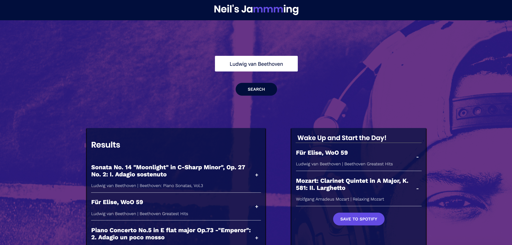

## INTRODUCTION

In this project, I have built a React web application called Neil's Jam. Using React with the Spotify API here is a webapp that allows users to search the Spotify library, create a custom playlist, then save it to their Spotify account.

## DEMO

[Youtube](https://youtu.be/Kl5_X3TRpXo)

## SEE IT LIVE :blush:

[Live version here, Click Me.](http://neilsreactplaylist.surge.sh/)

## Blog

Link to Article:
[Medium](https://medium.com/@neilvseejoor/going-to-class-an-introduction-to-javascript-classes-781bdc2f0bf7)

## Usage

`git clone`

`npm install && npm start`

# Authors
* **Neil V.** - *Initial work* - [Github](https://github.com/urbanvas)

## Contributing

Bug reports and pull requests are welcome on GitHub at https://github.com/urbanvas/Spotify-React. This project is intended to be a safe, welcoming space for collaboration, and contributors are expected to adhere to the [Contributor Covenant](http://contributor-covenant.org) code of conduct.

## Code of Conduct

Everyone interacting in the SpotifyReact project’s codebases, issue trackers, chat rooms and mailing lists is expected to follow the code of conduct.

## Licence 

MIT licence

Copyright <2019> <Neil>

Permission is hereby granted, free of charge, to any person obtaining a copy of this software and associated documentation files (the "Software"), to deal in the Software without restriction, including without limitation the rights to use, copy, modify, merge, publish, distribute, sublicense, and/or sell copies of the Software, and to permit persons to whom the Software is furnished to do so, subject to the following conditions:

The above copyright notice and this permission notice shall be included in all copies or substantial portions of the Software.

THE SOFTWARE IS PROVIDED "AS IS", WITHOUT WARRANTY OF ANY KIND, EXPRESS OR IMPLIED, INCLUDING BUT NOT LIMITED TO THE WARRANTIES OF MERCHANTABILITY, FITNESS FOR A PARTICULAR PURPOSE AND NONINFRINGEMENT. IN NO EVENT SHALL THE AUTHORS OR COPYRIGHT HOLDERS BE LIABLE FOR ANY CLAIM, DAMAGES OR OTHER LIABILITY, WHETHER IN AN ACTION OF CONTRACT, TORT OR OTHERWISE, ARISING FROM, OUT OF OR IN CONNECTION WITH THE SOFTWARE OR THE USE OR OTHER DEALINGS IN THE SOFTWARE.
